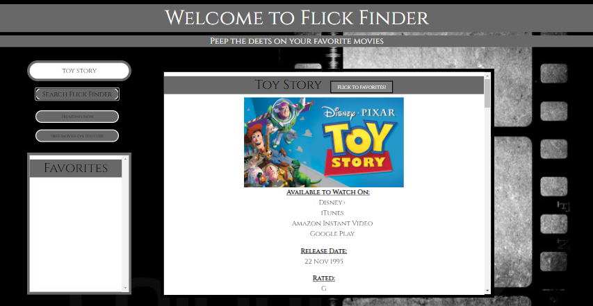
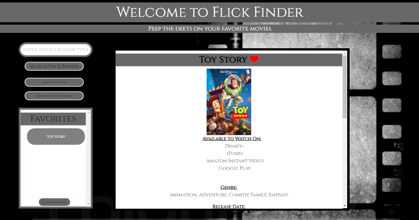

# Flick Finder

An application to find where your favorite flicks are on the web.

Created January 21st, 2021 by __Treecko Productions__.

## Links:
##

__GitHub Repo:__ https://github.com/ElderBass/API-Project-Treecko.git

__Deployed:__ https://elderbass.github.io/API-Project-Treecko/

# Development

## Project Team:

* Front End Development:

    * __Fong Vang__ - carousel and embedded links, footer, accessory pages | CSS, Foundation, HTML5
    
    * __Kelsey Bergstrom__ - page layout, style theme, styling buttons/containers/inputs, header | CSS, Foundation, HTML5

* Back End Development:

    * __Seth Zygarlicke__ - query/search functionality, logic for search and favorite buttons, alert modals, local storage

    * __Michael Wester__ - logic testing and debugging, 'waiting for search' feature, query/search functionality

## Technologies:
#

This project utilized several languages and frameworks for functionality and styling.

* __HTML5__ for base webpage framework and layout of content

* __CSS__ for styling and aesthetic choices for the various elements of the project

* __Foundation__ as a third-party CSS framework for help with more advanced aesthetic elements such as modals and carousels

* __Javascript/JQuery__ for back-end functionality, user search tools, accessing third-party APIs and more

* __APIs:__ 'Utelly' for displaying array of search results and 'OMDB' for specific/detailed information on various titles

* __GitHub__ for project management, accessing, manipulating, and storing the repository and deploying the app to web

* __VS Code__ as a tool for compiling all of the code

# Application Details

## Purpose:

Flick Finder is an application created to discover on which media platforms a movie or show can be accessed, instead of the user having to log into multiple different apps for multiple different streaming services to search for that title. Information about these titles is provided on search, and the user can save movies as favorites for quick reference. Flick Finder also shows the user trailers for the Top 10 Trending movies out, and has links for free movies available on YouTube. 

## Description:

Flick Finder centers around its search functionality. The user enters the name of a title into the search, and the results populate the page with information about each title including, principally, on which media services that title can be found, using the Utelly free API. Another query for the OMDB API is made simultaneously alongside the Utelly query, to gleen basic information for each search result which appears below the poster and title of each result. A 'Flick to Favorites' button also pops up with the title, which allows the user to save any search result as a Favorite. 

Adding a favorite creates another button with that title's name on it, which pops up in the 'Favorites' container on the screen. Clicking on this title populates the page with more detailed information on that title. A modal alert also appears on screen, letting the user know the movie was successfully added to favorites. If a movie has already been favorited, when the user clicks the button again, a different alert tells the user of this fact.

Also featured on the main screen is a carousel object containing embedded trailers for the current top 10 trending movies online. Below this sits three rows of clickable movie posters for free movies on YouTube. Clicking one of these posters takes you to the movie's page on YouTube. At the top of the page, the user can find buttons that will redirect the user to each of these features immediately. 

A footer at the bottom of the page contains the Treecko Productions icon and three links - 'About Flick Finder', 'Contact Us', and 'My Account'. In the 'About' page the user can find quick bios on the various brains behind Flick Finder and Treecko Productions. The 'Contact' page contains information on how to connect with us at Treecko Productions. Clicking 'My Account' will do something super cool in the future, no doubt. 

For a demonstration of this web application, please see the 'Demonstration' section below.

# Future Development

To perform this title search, Flick Finder utilizes the free Utelly API which to search for movies by the given keyword entered by the user. The free version of this API only posts up to five results, unfortunately. A future evolution of Flick Finder could be to use a more robust API for this task instead.

It would also behoove Treecko to find away to have links to each service on which a certain title is featured, so that when the search results are displayed along with the services on offer, the user can click those links to directly navigate to the desired title's page on a certain service. This was not possible with the current APIs. 

Another feature worth adding would be having the user create a free account. This account can track search histroy, display any news about titles they've favorited and related news from the various media services like Netflix, and suggest titles the user might like based on history and favorites. 

# Files in Repository

Inside the Assets folder one will find a folder CSS containing the style.css file, where virtually all of the styling/formatting of the project is elaborated, and the JS folder, containing the script.js file that works out all the magic of the Flick Finder app. Also in the assets folder is the logo for Treecko Productions. 

The index.html file contains all of the major HTML5 source code for the main page of Flick Finder, including the search bar and results container, carousel of trending movie trailers, links to free movies on YouTube, and the footer with related links.

The contact.html file has a form for contacting Treecko productions. The about.html page has a brief description of Treecko productions mission and team. Both of these are found outside of any folders, alongside the index.html and README.md files. 

# Demonstration:

